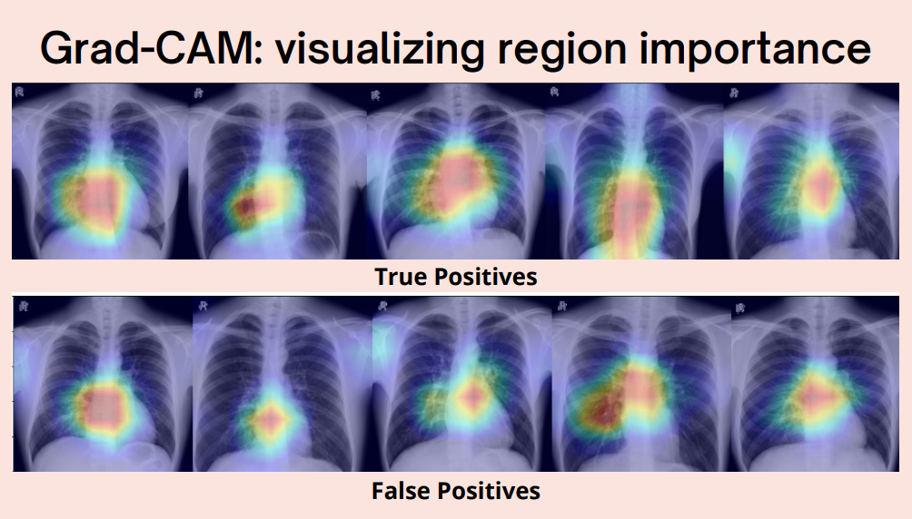
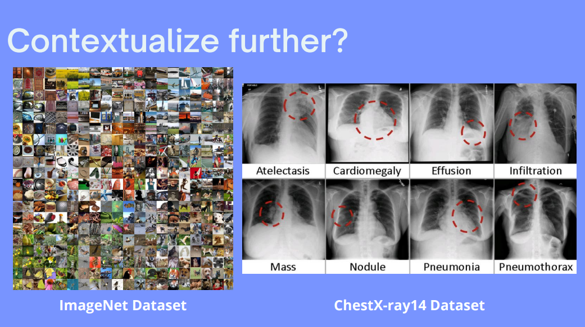
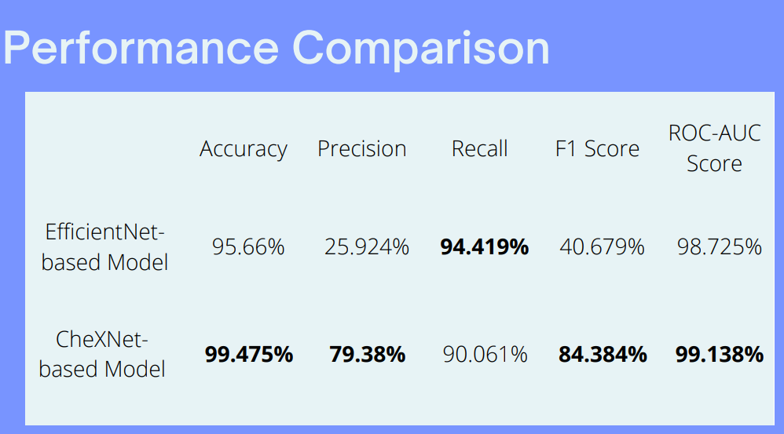

# NAPI Internship

Last January 2022, I was accepted as an intern at the Nara Institute of Science and Technology (NAIST) under the Computational Systems Biology Laboratory. During this internship, I was introduced to a project of the lab which aims to detect scoliosis on chest X-ray images via deep learning. The model created by the lab was based on the [EfficientNet architecture](https://ai.googleblog.com/2019/05/efficientnet-improving-accuracy-and.html). 

I was able to create a model that outperformed the lab's model in terms of accuracy, precision, F1-score, and ROC-AUC score, with the lab's model edging out mine in recall. See the presentation deck for more info on this performance comparison. I trained my model via transfer learning on the [CheXNet model](https://arxiv.org/pdf/1711.05225v3.pdf) with weights obtained from this [Github repository](https://github.com/brucechou1983/CheXNet-Keras).

This repository contains all the files that I used during this internship period. Unfortunately, due to privacy issues, I will not be sharing the dataset and the files for the models themselves. Only the notebooks and final presentation deck will be included in this repository.